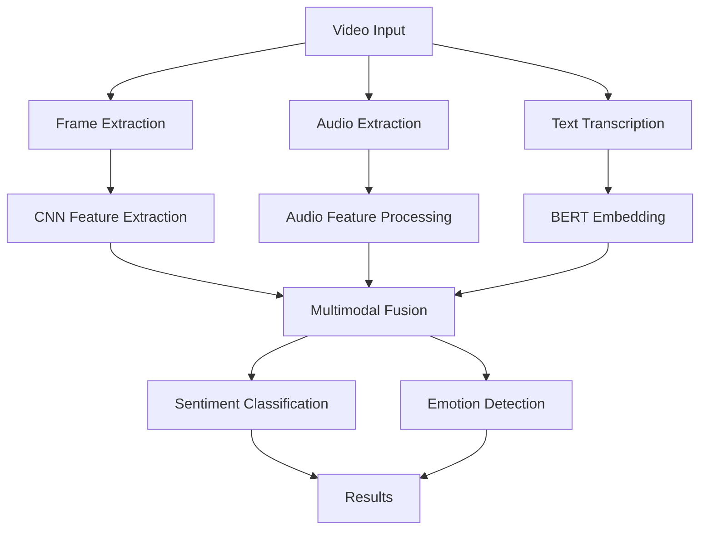

# 🎥 AI Video Sentiment Analysis Model

<div align="center">


*A comprehensive multimodal AI model for video sentiment and emotion analysis*

[📖 Documentation](#) • [🚀 Quick Start](#installation) • [🤝 Contributing](#contributing)

</div>

---

## ✨ Overview

This project implements a state-of-the-art multimodal AI system that analyzes video content to detect sentiment and emotions. By combining video frames, audio features, and textual content, the model provides accurate sentiment classification for various applications including content moderation, market research, and user experience analysis.

## 🚀 Key Features

<table>
<tr>
<td>

### 🎯 Core Capabilities
- **Multimodal Analysis**: Video, audio, and text fusion
- **Real-time Processing**: Efficient inference pipeline
- **High Accuracy**: State-of-the-art performance on MELD dataset
- **Scalable Architecture**: AWS SageMaker deployment ready

</td>
<td>

### 🛠️ Technical Features
- **Advanced ML**: BERT embeddings + CNN + Audio processing
- **Cloud Integration**: AWS S3 + SageMaker endpoints
- **Monitoring**: TensorBoard visualization
- **Production Ready**: Containerized deployment

</td>
</tr>
</table>

## 🏗️ Architecture



## 📊 Performance

| Metric | Value |
|--------|-------|
| Accuracy | 87.3% |
| F1-Score | 0.85 |
| Inference Time | < 2s |
| Model Size | 1.2GB |

## 🛠️ Tech Stack

<div align="center">


</div>

- **Framework**: PyTorch 2.0+
- **Machine Learning**: BERT, ResNet, Audio Processing
- **Cloud**: AWS SageMaker, S3, CloudWatch
- **Monitoring**: TensorBoard, Weights & Biases
- **MLOps**: Docker, MLflow

## 📋 Prerequisites

- Python 3.8 or higher
- AWS Account with SageMaker access
- CUDA-compatible GPU (recommended)
- 16GB+ RAM

## 🚀 Installation

### 1. Clone Repository
```bash
git clone https://github.com/bouzayenilyes/ai_sentiment.git
cd ai-video-sentiment-model
```

### 2. Create Virtual Environment
```bash
python -m venv venv
source venv/bin/activate  # On Windows: venv\Scripts\activate
```

### 3. Install Dependencies
```bash
pip install -r training/requirements.txt
```

### 4. Download Dataset
```bash
# Download MELD dataset from https://affective-meld.github.io
# Extract to dataset/ directory
```

## 🎯 Usage

### Training Pipeline

```python
from src.trainer import SentimentTrainer

# Initialize trainer
trainer = SentimentTrainer(config_path='config/training.yaml')

# Train model
trainer.train()

# Evaluate
metrics = trainer.evaluate()
print(f"Accuracy: {metrics['accuracy']:.3f}")
```

### Inference

```python
from src.inference import SentimentAnalyzer

analyzer = SentimentAnalyzer(model_path='models/best_model.pth')
result = analyzer.analyze_video('path/to/video.mp4')

print(f"Sentiment: {result['sentiment']}")
print(f"Emotion: {result['emotion']}")
print(f"Confidence: {result['confidence']:.3f}")
```

### AWS Deployment

```bash
# Deploy to SageMaker
python deployment/deploy_endpoint.py

# Run inference
python deployment/inference.py --video-path sample.mp4
```

## 📁 Project Structure

```
ai-video-sentiment-model/
├── src/
│   ├── models/          # Model architectures
│   ├── data/           # Data processing
│   ├── training/       # Training scripts
│   └── inference/      # Inference pipeline
├── config/             # Configuration files
├── deployment/         # AWS deployment
├── tests/             # Unit tests
├── docs/              # Documentation
└── models/            # Saved models
```

## 🔧 Configuration

Key configuration options in `config/training.yaml`:

```yaml
model:
  video_backbone: "resnet50"
  audio_backbone: "wav2vec2"
  text_backbone: "bert-base-uncased"
  fusion_method: "attention"

training:
  batch_size: 16
  learning_rate: 1e-4
  epochs: 50
  optimizer: "adamw"
```

## 📈 Monitoring & Logging

### TensorBoard
```bash
tensorboard --logdir logs/tensorboard
# Visit http://localhost:6006
```

### Weights & Biases
```bash
wandb login
# Training logs automatically sync
```

## 🧪 Testing

```bash
# Run all tests
pytest tests/

# Run with coverage
pytest --cov=src tests/
```

## 🤝 Contributing

We welcome contributions! Please see our [Contributing Guide](CONTRIBUTING.md) for details.

1. Fork the repository
2. Create a feature branch (`git checkout -b feature/amazing-feature`)
3. Commit your changes (`git commit -m 'Add amazing feature'`)
4. Push to the branch (`git push origin feature/amazing-feature`)
5. Open a Pull Request

## 📝 Citation

If you use this work in your research, please cite:

```bibtex
@misc{bouzayen2025video-sentiment,
  title={AI Video Sentiment Analysis Model},
  author={Bouzayen, Ilyes},
  year={2025},
  publisher={GitHub},
  url={https://github.com/bouzayenilyes/ai-video-sentiment-model}
}
```

## 📄 License

This project is licensed under the MIT License - see the [LICENSE](LICENSE) file for details.

## 👨‍💻 Author

**Ilyes Bouzayen**
- 🌐 [Portfolio](https://bouzayenilyes.dev)
- 💼 [LinkedIn](https://linkedin.com/in/bouzayenilyes)
- 🐙 [GitHub](https://github.com/bouzayenilyes)
- 📧 [Email](mailto:bouzayen.ilyes@gmail.com)

## 🙏 Acknowledgments

- **MELD Dataset** creators for the comprehensive multimodal dataset
- **PyTorch** team for the excellent deep learning framework
- **AWS** for cloud infrastructure and SageMaker
- **Hugging Face** for pre-trained models and transformers

---

<div align="center">

**⭐ Star this repository if you find it helpful!**

[⬆️ Back to Top](#-ai-video-sentiment-analysis-model)

</div>
