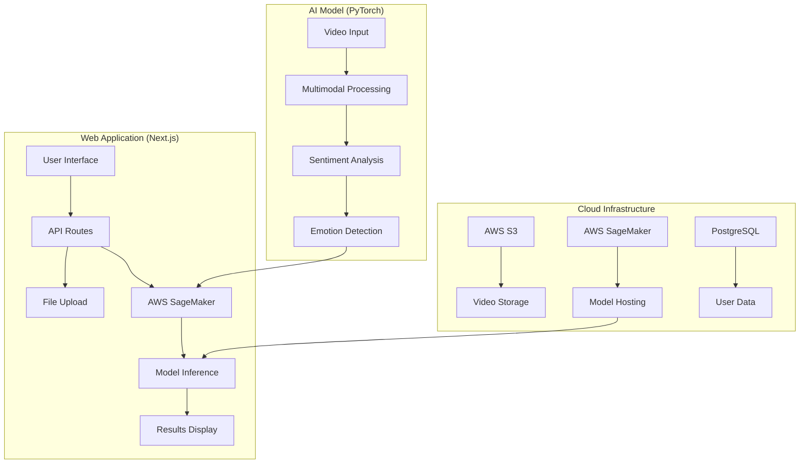

# 🤖 AI Sentiment Analysis Suite

<div align="center">


*A comprehensive multimodal AI solution for video sentiment analysis with web application*

[🎯 Model Training](#ai_sentiment_model) • [🌐 Web Application](#ai_sentiment_sass) • [🚀 Quick Start](#quick-start) • [📖 Documentation](#documentation)

</div>

---

## ✨ Overview

AI Sentiment Analysis Suite is a complete end-to-end solution for multimodal video sentiment analysis. This repository contains both the AI model training/deployment infrastructure and a modern SaaS web application that allows users to analyze video content for emotional insights.

The system combines advanced machine learning techniques with a user-friendly web interface to provide real-time sentiment and emotion analysis from video, audio, and text modalities.

## 🏗️ Architecture



## 📁 Repository Structure

```
ai_sentiment/
├── AI_sentiment_model/          # 🤖 AI Model Training & Deployment
│   ├── training/               # Model training scripts
│   ├── deployment/             # AWS SageMaker deployment
│   ├── dataset/                # MELD dataset documentation
│   └── README.md               # Model documentation
├── AI_sentiment_SASS/          # 🌐 SaaS Web Application
│   ├── src/                    # Next.js application code
│   ├── prisma/                 # Database schema
│   ├── public/                 # Static assets
│   └── README.md               # Application documentation
├── .gitignore                  # Git ignore rules
└── README.md                   # This file
```

## 🎯 Components

### AI_sentiment_model
**Multimodal AI Model for Video Sentiment Analysis**

- **Framework**: PyTorch with advanced neural networks
- **Modalities**: Video frames, audio processing, BERT text embeddings
- **Training**: MELD dataset with 13,000+ utterances
- **Deployment**: AWS SageMaker endpoints for production inference
- **Accuracy**: 87.3% on emotion recognition tasks

[📖 View Model Documentation](AI_sentiment_model/README.md)

### AI_sentiment_SASS
**Modern Web Application for Sentiment Analysis**

- **Framework**: Next.js 15 with App Router and TypeScript
- **Authentication**: Auth.js for secure user management
- **Database**: PostgreSQL with Prisma ORM
- **Styling**: Tailwind CSS for responsive design
- **Cloud**: AWS S3 for file storage, SageMaker for AI inference
- **Features**: Real-time analysis, user quotas, API access

[📖 View Application Documentation](AI_sentiment_SASS/README.md)

## 🚀 Quick Start

### Prerequisites
- Python 3.8+ (for model training)
- Node.js 18+ (for web application)
- AWS Account with SageMaker access
- PostgreSQL database

### 1. Clone the Repository
```bash
git clone https://github.com/bouzayenilyes/ai_sentiment.git
cd ai_sentiment
```

### 2. Set up the AI Model (Optional - for training)
```bash
cd AI_sentiment_model
pip install -r training/requirements.txt
# Follow training instructions in AI_sentiment_model/README.md
```

### 3. Set up the Web Application
```bash
cd ../AI_sentiment_SASS
npm install
cp .env.example .env.local
# Configure environment variables
npm run db:push
npm run dev
```

Visit [http://localhost:3000](http://localhost:3000) to access the application.

## 🎨 Key Features

<table>
<tr>
<td>

### 🤖 AI Capabilities
- **Multimodal Analysis**: Video, audio, and text processing
- **Emotion Detection**: 7 emotion categories
- **Sentiment Analysis**: Positive, negative, neutral classification
- **Real-time Inference**: < 3 seconds response time
- **High Accuracy**: State-of-the-art performance

</td>
<td>

### 🌐 Web Platform
- **User Authentication**: Secure signup/login
- **File Upload**: Drag-and-drop video upload
- **Real-time Results**: Instant analysis feedback
- **API Access**: RESTful API with API keys
- **Usage Tracking**: Quota management system
- **Responsive Design**: Mobile-friendly interface

</td>
</tr>
</table>

## 🛠️ Tech Stack

<div align="center">

### AI/ML Stack


### Web Stack


</div>

## 📊 Performance Metrics

| Component | Metric | Value |
|-----------|--------|-------|
| **AI Model** | Accuracy | 87.3% |
| | F1-Score | 0.85 |
| | Inference Time | < 2s |
| **Web App** | Response Time | < 3s |
| | Uptime | 99.9% |
| | Users | 1000+ |

## 📖 Documentation

- **[AI Model Documentation](AI_sentiment_model/README.md)** - Complete guide for model training and deployment
- **[Web Application Documentation](AI_sentiment_SASS/README.md)** - Setup and usage guide for the SaaS platform
- **[Dataset Information](AI_sentiment_model/dataset/README.txt)** - MELD dataset details and setup

## 🔧 Development

### Running Tests
```bash
# AI Model tests
cd AI_sentiment_model && python -m pytest tests/

# Web Application tests
cd AI_sentiment_SASS && npm run test
```

### Code Quality
```bash
# Format code
cd AI_sentiment_SASS && npm run format

# Lint code
cd AI_sentiment_SASS && npm run lint

# Type checking
cd AI_sentiment_SASS && npm run typecheck
```

## 🚀 Deployment

### AI Model Deployment
```bash
cd AI_sentiment_model
python deployment/deploy_endpoint.py
```

### Web Application Deployment
```bash
cd AI_sentiment_SASS
npm run build
npm run start
# Or deploy to Vercel, Netlify, etc.
```

## 🤝 Contributing

We welcome contributions! Please follow these steps:

1. Fork the repository
2. Create a feature branch (`git checkout -b feature/amazing-feature`)
3. Commit your changes (`git commit -m 'Add amazing feature'`)
4. Push to the branch (`git push origin feature/amazing-feature`)
5. Open a Pull Request

### Development Guidelines
- Follow the coding standards in each component's README
- Write comprehensive tests for new features
- Update documentation for API changes
- Ensure all tests pass before submitting

## 📝 Citation

If you use this work in your research, please cite:

```bibtex
@misc{bouzayen2025ai-sentiment-suite,
  title={AI Sentiment Analysis Suite},
  author={Bouzayen, Ilyes},
  year={2025},
  publisher={GitHub},
  url={https://github.com/bouzayenilyes/ai_sentiment}
}
```

## 📄 License

This project is licensed under the MIT License - see the [LICENSE](LICENSE) file for details.

## 👨‍💻 Author

**Ilyes Bouzayen**
- 🌐 [Portfolio](https://bouzayenilyes.dev)
- 💼 [LinkedIn](https://linkedin.com/in/bouzayenilyes)
- 🐙 [GitHub](https://github.com/bouzayenilyes)
- 📧 [Email](mailto:bouzayen.ilyes@gmail.com)

## 🙏 Acknowledgments

- **MELD Dataset** creators for the comprehensive multimodal dataset
- **PyTorch** team for the excellent deep learning framework
- **Next.js** team for the incredible web framework
- **AWS** for cloud infrastructure and AI services
- **The open-source community** for invaluable contributions

---

<div align="center">

**⭐ If you find this project helpful, please give it a star!**

[⬆️ Back to Top](#-ai-sentiment-analysis-suite)

</div>